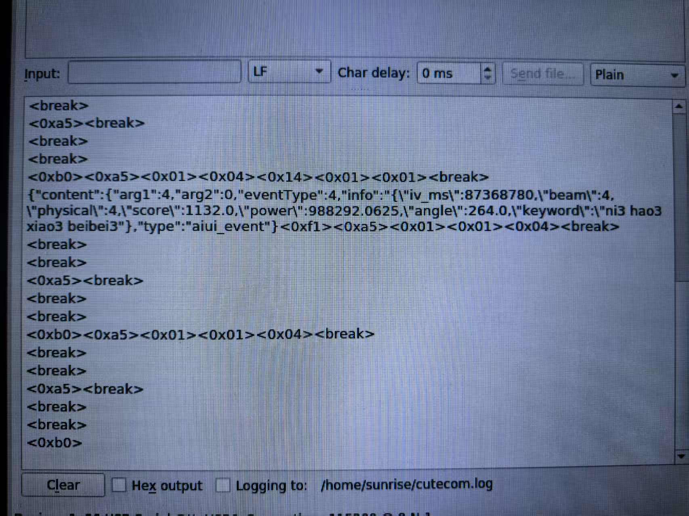
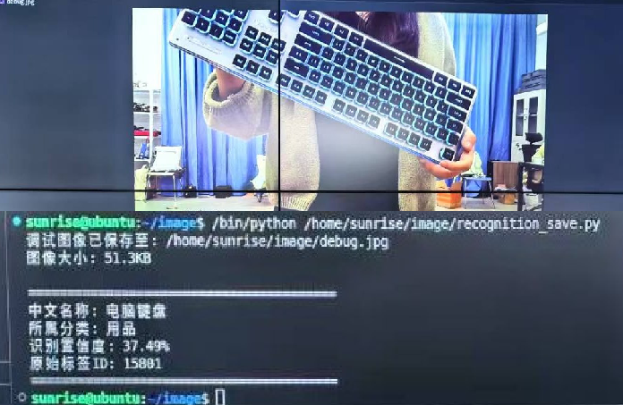

# AuroraInteractX
轻量级智能机器人开发框架，专注实时语音交互、声源定位、人体跟随与场景理解四大核心能力。由独立机器人开发团队构建，采用模块化ROS架构与多传感器融合技术，提供竞赛级开箱即用解决方案，支持快速部署至NVIDIA Jetson等嵌入式平台。

## 离线语音唤醒
### 自启动
在/etc/systemd/system/xiaobei.service中设置自启动xiaobei.py脚本

```
[Unit]
Description=Start Xiaobei Wakeword Listener
After=network.target

[Service]
ExecStart=/usr/bin/python3 /home/sunrise/display_robot/xiaobei.py
WorkingDirectory=/home/sunrise/Downloads
Restart=always
User=sunrise
Group=sunrise
Environment=PATH=/usr/bin:/bin:/usr/sbin:/sbin
Environment=PYTHONUNBUFFERED=1
StandardOutput=syslog
StandardError=syslog

[Install]
WantedBy=multi-user.target
```
 #### 监听串口 /dev/ttyUSB0（波特率 115200），从语音识别设备接收 JSON 格式数据
 #### 解析 JSON，如果 eventType == 4，则表示检测到 唤醒词（Wake Word）
 #### 执行 all.py 脚本（非阻塞方式），处理唤醒后的操作（比如语音助手或智能设备控制）

 [自启动flowus](https://flowus.cn/maiqi/b309ab82-f98d-4168-8231-f8f6185ff100)

 ### 可以安装cutecom进行测试能否监听到唤醒词
 

 ### 小北唤醒词开机没有正常自启动现象
 重新加载systemctl服务

 ```sudo systemctl daemon-reload```

 启动语音唤醒服务

 ```sudo systemctl start xiaobei.service```

 检查服务是否成功启动

 ```sudo systemctl status xiaobei.service```


## 场景识别

### 安装guvcview工具来调整摄像头
```sudo apt-get install guvcview```

```guvcview -d /dev/video8```

```ls /dev/video*```

### 安装依赖
```python3.11 -m pip install opencv-python```

```python3.11 -m pip install openpyxl```

```python3.11 -m pip install pandas```

 
