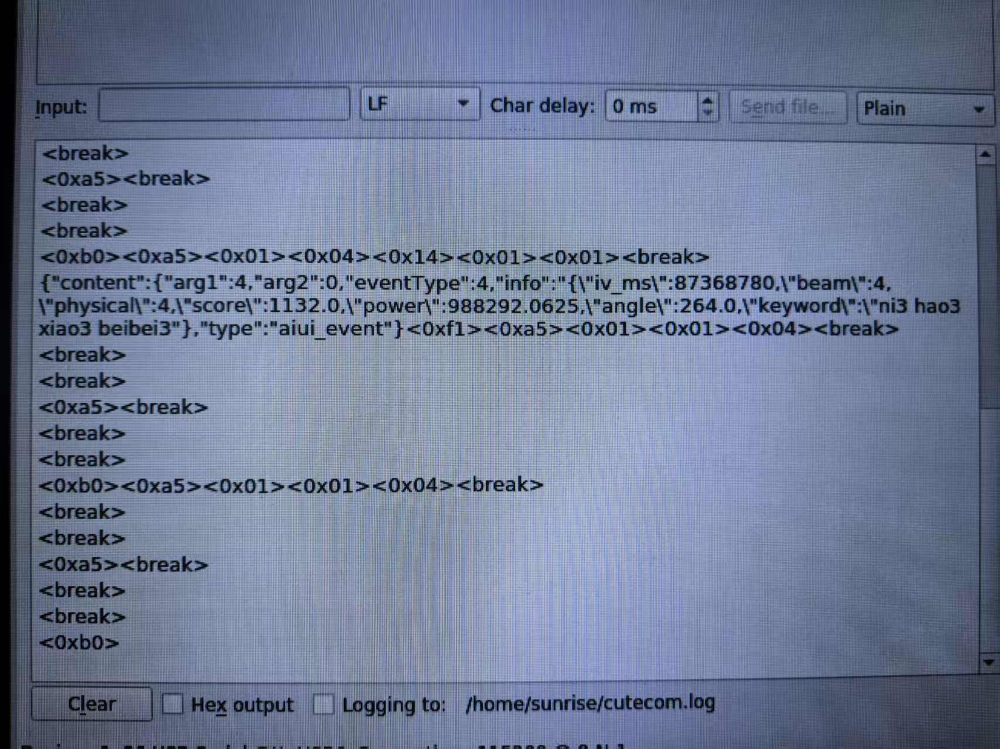
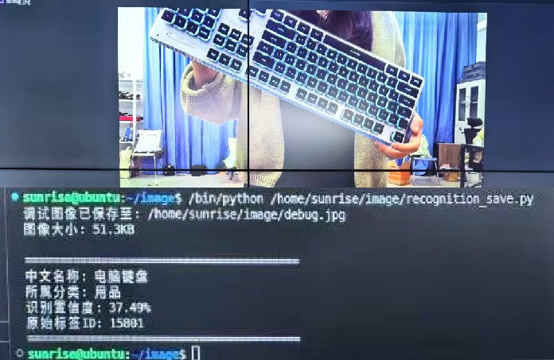
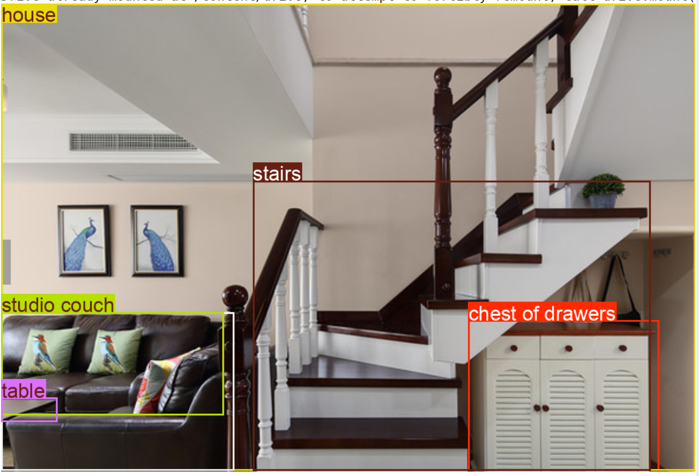
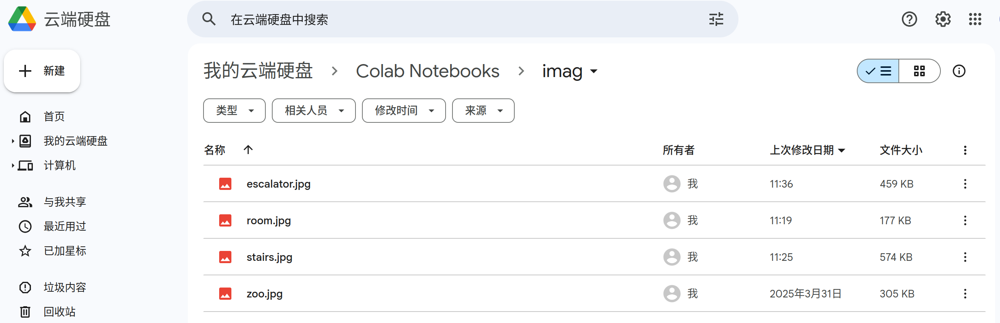

# AuroraInteractX
轻量级智能机器人开发框架，专注实时语音交互、声源定位、人体跟随与场景理解四大核心能力。由独立机器人开发团队构建，采用模块化ROS架构与多传感器融合技术，提供竞赛级开箱即用解决方案，支持快速部署至NVIDIA Jetson等嵌入式平台。本仓库只提供部分功能的参考实现。

## 核心功能模块

### 1. 语音交互系统 (voice_interact/)
完整的实时语音对话解决方案，包含唤醒、识别、AI回答和语音合成全流程

### 2. 音乐播放系统 (applay_music/)
智能语音命令解析与音乐搜索播放功能

### 3. 场景识别系统 (image_record/)
摄像头实时场景识别，支持API和深度学习两种方案

---

## 语音交互系统

### 离线语音唤醒
### 自启动
在/etc/systemd/system/xiaobei.service中设置自启动xiaobei.py脚本

```
[Unit]
Description=Start Xiaobei Wakeword Listener
After=network.target

[Service]
ExecStart=/usr/bin/python3 /home/sunrise/display_robot/xiaobei.py
WorkingDirectory=/home/sunrise/Downloads
Restart=always
User=sunrise
Group=sunrise
Environment=PATH=/usr/bin:/bin:/usr/sbin:/sbin
Environment=PYTHONUNBUFFERED=1
StandardOutput=syslog
StandardError=syslog

[Install]
WantedBy=multi-user.target
```

#### 唤醒流程说明

**核心文件**：`xiaobei.py`

**工作原理**：
- 监听串口 `/dev/ttyUSB0`（波特率 115200），从语音识别设备接收 JSON 格式数据
- 解析 JSON，如果 `eventType == 4`，则表示检测到唤醒词（Wake Word）
- 执行 `all.py` 脚本（非阻塞方式），处理唤醒后的操作（比如语音助手或智能设备控制）

#### 故障排查与测试

可以安装cutecom进行测试能否监听到唤醒词


小北唤醒词开机没有正常自启动现象时的解决方案：

重新加载systemctl服务
```bash
sudo systemctl daemon-reload
```

启动语音唤醒服务
```bash
sudo systemctl start xiaobei.service
```

检查服务是否成功启动
```bash
sudo systemctl status xiaobei.service
```

[自启动详细配置](https://flowus.cn/maiqi/b309ab82-f98d-4168-8231-f8f6185ff100)

### 语音识别（Speech-to-Text）
基于讯飞WebSocket API的实时语音识别，将用户语音转录为文本

**核心文件**：`iat_python3.py`

**功能特点**：
- 流式音频处理，低延迟实时识别
- 支持热词定制和方言识别
- 自动保存识别文本到 `txt/question.txt`

**工作流程**：
1. 读取音频文件（WAV格式，16kHz采样率）
2. 使用HMAC-SHA256鉴权生成WebSocket连接URL
3. 分帧发送音频数据（每帧8000字节）
4. 接收识别结果JSON，提取文本内容
5. 保存识别结果到文件

**依赖**：
```bash
pip install websocket-client
```

### AI智能回答（AI Response Generation）
调用Kimi AI大模型生成智能回答

**核心文件**：`ai_answer.py`

**功能特点**：
- 支持长上下文对话（Moonshot v1-8k模型，8K tokens）
- 自动读取用户问题，生成回答
- 结果保存到 `txt/answer.txt`

**工作流程**：
1. 读取 `question.txt` 中的用户问题
2. 调用Kimi API（https://api.moonshot.cn/v1/chat/completions）
3. 接收模型生成的回答
4. 保存结果到文件

**依赖**：
```bash
pip install requests
```

**配置**：需要替换为实际的Kimi API密钥

### 文本处理与分割
将AI回答进行清理和分割，优化TTS处理效率

**文本清理**（`bettertxt.py`）：
- 移除特殊符号（如`*`等标记符）
- 删除空行
- 输出 `txt/bettertxt.txt`

**文本分割**（`depart.py`）：
- 将长文本均匀分割为5部分
- 分别保存为 `better1.txt` ~ `better5.txt`
- 便于并行TTS处理，提高合成效率

### 文本转语音（Text-to-Speech）
基于讯飞WebSocket TTS API的高质量语音合成

**核心文件**：`tts_python1.py` ~ `tts_python5.py`（支持5路并行合成）

**功能特点**：
- WebSocket双向通信
- PCM音频接收和WAV格式转换
- 支持多种发音人选择（如"aisbabyxu"）
- 自动将PCM转换为WAV格式

**工作流程**：
1. 读取分割后的文本文件
2. Base64编码文本内容
3. 通过WebSocket连接讯飞TTS服务
4. 接收PCM格式音频流
5. 使用pydub库转换为WAV格式
6. 保存为 `audio/answer1.wav` ~ `audio/answer5.wav`

**依赖**：
```bash
pip install websocket-client pydub
```

### 主控制流程（all.py）
协调整个语音交互系统的执行顺序和时序控制

**工作流程**（三阶段）：

**第一阶段**：初始化与录音
- 播放欢迎提示音（imhere.wav）
- 通过 `arecord` 命令录制用户语音（5秒）
- 支持多个音频设备（hw:0,0 / hw:0,1 / hw:1,0 / hw:1,1）

**第二阶段**：顺序处理
- 依次执行：语音识别 → AI回答 → 文本清理 → 文本分割 → TTS合成
- 各步骤串行执行，确保数据依赖关系
- 后台线程播放"请稍等"提示音

**第三阶段**：并行合成与播放
- 使用多进程并行执行5个TTS脚本
- 后台线程播放合成后的语音
- 等待所有任务完成

**特点**：
- 使用Process多进程并行处理TTS
- 使用threading进行音频播放控制
- 完整的错误处理和状态监控

---

## 音乐播放系统

### 智能音乐搜索与播放

**核心文件**：`applay_music/music_search.py`

**功能特点**：
- 自然语言指令解析
- 网易云音乐API搜索
- VLC多媒体播放器集成
- 实时播放状态监控

**支持的语音指令**：
```
- "播放[歌手]的[歌名]"           # 例：播放林俊杰的江南
- "来一首[歌名]"                # 例：来一首江南
- "我想听[歌手]唱的[歌名]"      # 例：我想听林俊杰唱的江南
```

**工作流程**：

1. **指令解析**（`parse_music_command`）
   - 使用正则表达式匹配多种说法
   - 提取歌手名和歌曲名

2. **音乐搜索**（`search_music_on_netease`）
   - 调用网易云API：`http://music.163.com/api/search/get`
   - 参数：搜索关键词、类型(1=歌曲)、返回数量(1=第一首)
   - 返回音乐ID、名称、歌手、专辑等信息

3. **音乐播放**（`play_music`）
   - 构建网易云MP3直链：`http://music.163.com/song/media/outer/url?id={song_id}.mp3`
   - 使用VLC播放器进行播放
   - 监控播放状态，等待播放完成

**依赖**：
```bash
pip install requests python-vlc
```

**配置**：
- `KEYWORDS_PATH`：关键词输出文件路径
- `AUDIO_TEXT_PATH`：音频转文本文件路径

---

## 场景识别系统

### 方法一：讯飞视觉API识别（main分支）

**核心文件**：`image_record/recognition_save.py`

**功能特点**：
- 实时摄像头图像捕获
- 讯飞视觉API云识别
- Excel标签映射自动转换
- 完整的图像预处理管道

**工作流程**：

1. **摄像头初始化和图像捕获**
   - 初始化 `/dev/video8` 设备
   - 自动捕获单帧图像

2. **图像预处理**
   - 调整分辨率至640×480
   - 高斯模糊降噪处理
   - JPEG编码并压缩（质量80）

3. **讯飞API请求**
   - 生成时间戳 (X_CurTime)
   - Base64编码业务参数生成 X_Param
   - MD5校验：`hashlib.md5(APIKey + CurTime + Param).hexdigest()`
   - POST请求到 `http://tupapi.xfyun.cn/v1/currency`

4. **结果映射和处理**
   - 读取 `label.xlsx` 标签映射表
   - 将API返回的数字label转换为中文名称
   - 获取物体分类信息

**安装与配置**：

```bash
# 安装guvcview工具调整摄像头
sudo apt-get install guvcview
guvcview -d /dev/video8

# 查看系统中的所有摄像头设备
ls /dev/video*
```

**安装依赖**：
```bash
pip install opencv-python openpyxl pandas requests
```



### 方法二：Florence2 + YOLOv11 深度学习识别（florence_yolo分支）

**核心文件**：`image_record/florenc2_yolo.py`

**功能特点**：
- Microsoft Florence-2视觉基础模型
- YOLOv11目标检测和定位
- GPU加速（NVIDIA CUDA）
- 深度学习与自然语言处理结合
- 支持目标检测框(bboxes)和标签输出

**技术栈**：
- **Florence-2**：大规模视觉基础模型，支持多种视觉任务
- **YOLOv11**：最新一代目标检测算法
- **PyTorch**：深度学习框架
- **CUDA 12.4**：GPU并行计算
- **Transformers**：模型加载和推理

**工作流程**：

1. **模型加载**
   - 从Hugging Face加载 `microsoft/Florence-2-large`
   - 移至GPU运行（float16精度优化）

2. **图像处理**
   - 从Google Drive或本地读取图像
   - PIL格式加载和预处理

3. **模型推理**
   ```python
   inputs = processor(text=prompt, images=image, return_tensors="pt").to("cuda")
   generated_ids = model.generate(
       input_ids=inputs["input_ids"].cuda(),
       pixel_values=inputs["pixel_values"].cuda(),
       max_new_tokens=1024,
       num_beams=3
   )
   ```

4. **结果解析**
   - 返回JSON格式：`{"<OD>": {"bboxes": [[x1,y1,x2,y2],...], "labels": ["label1", ...]}}`
   - 目标检测框坐标和类别标签

**安装NVIDIA环境**：

```bash
# 查看可用的nvidia驱动
sudo ubuntu-drivers devices

# 安装推荐驱动版本
sudo apt install nvidia-driver-550

# 安装CUDA 12.4
# 访问官方链接下载并安装
# https://developer.nvidia.com/cuda-12-4-1-download-archive

# 安装PyTorch（支持CUDA）
# 访问 https://pytorch.org/ 获取安装命令
pip install torch torchvision torchaudio --index-url https://download.pytorch.org/whl/cu124
```

**安装依赖**：
```bash
pip install opencv-python pandas transformers ultralytics pillow
```

**Google Colab部署**（推荐）：

由于GPU计算需求较高，建议在Google Colab上运行此方案：

1. 访问 [Google Colab](https://colab.research.google.com/)
2. 在Colab中设置运行时为 GPU (T4或更高)
3. 将需要识别的图片上传至Google Drive
4. 在Colab中挂载Google Drive：
   ```python
   from google.colab import drive
   drive.mount('/content/drive')
   ```
5. 修改图像路径指向Google Drive中的文件
6. 运行推理脚本




